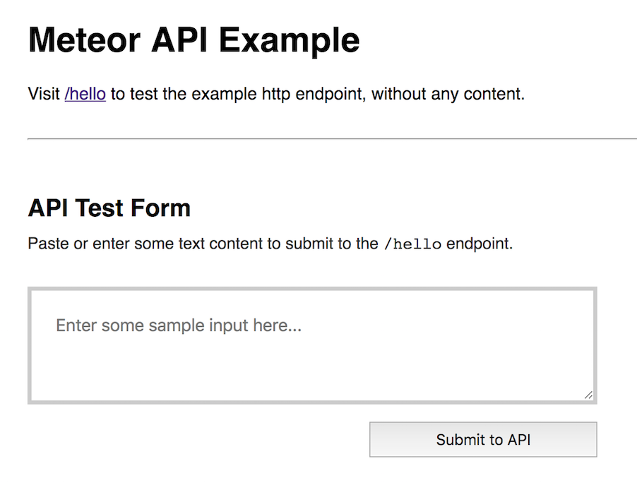

## Meteor HTTP API Example

A very basic example of creating an HTTP server endpoint with Meteor.

### Screenshot



### Installation

```bash
# Install meteor from https://www.meteor.com/install if needed.

# Clone repo
$ git clone git@github.com:sbrichardson/meteor_api_test.git

# cd into cloned repo
$ cd meteor_api_test

# Install dependencies
$ meteor npm install

# Start app
$ meteor

# Add --port flag if needed
$ meteor --port 3050

```

### Accessing App

Open browser to `http://localhost:3000`, or use a tool such as HTTPie/curl or the Insomnia Rest Client.

The http endpoint is at `http://localhost:3000/hello` by default.

### Notes

The endpoint source can be found at `/server/api/index.js`

The example client form can be found at `/client/main.html`

The form is using vanilla html currently.
